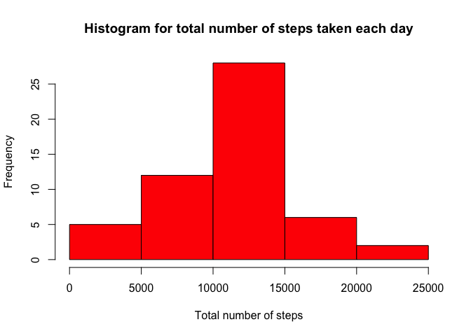
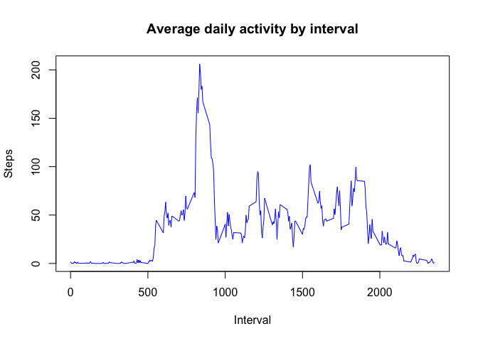
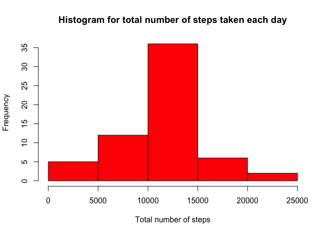
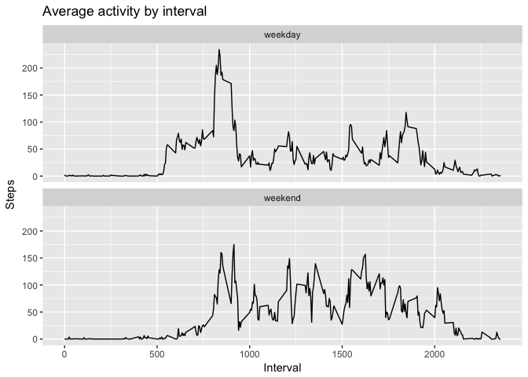

# Reproducible Research: Peer Assessment 1


## Loading and preprocessing the data

```r
activity <- read.csv("activity.csv", header = TRUE, sep = ",")
activity$date <- as.Date(activity$date, "%Y-%m-%d")
summary(activity)
```

```
##      steps             date               interval     
##  Min.   :  0.00   Min.   :2012-10-01   Min.   :   0.0  
##  1st Qu.:  0.00   1st Qu.:2012-10-16   1st Qu.: 588.8  
##  Median :  0.00   Median :2012-10-31   Median :1177.5  
##  Mean   : 37.38   Mean   :2012-10-31   Mean   :1177.5  
##  3rd Qu.: 12.00   3rd Qu.:2012-11-15   3rd Qu.:1766.2  
##  Max.   :806.00   Max.   :2012-11-30   Max.   :2355.0  
##  NA's   :2304
```


## What is mean total number of steps taken per day?

```r
## Calculate the total number of steps taken per day
stepsByDay <- tapply(activity$steps, activity$date, sum)

## Make a histogram of the total number of steps taken each day
hist(stepsByDay, main = "Histogram for total number of steps taken each day", xlab = "Total number of steps", col = "red")
```

<!-- -->

```r
## Calculate and report the mean and median of the total number of steps taken per day
summary(stepsByDay)
```

```
##    Min. 1st Qu.  Median    Mean 3rd Qu.    Max.    NA's 
##      41    8841   10765   10766   13294   21194       8
```

## What is the average daily activity pattern?


```r
## Make a time series plot (i.e. 𝚝𝚢𝚙𝚎 = "𝚕") of the 5-minute interval (x-axis) and the average number of steps taken, averaged across all days (y-axis)
averageActivity <- aggregate(steps ~ interval, data = activity, FUN = mean)
plot(averageActivity$interval, averageActivity$steps, type="l", pch = 18, col = "blue", xlab = "Interval", ylab = "Steps", main = "Average daily activity by interval")
```

<!-- -->

```r
## Which 5-minute interval, on average across all the days in the dataset, contains the maximum number of steps?
averageActivity[which.max(averageActivity$steps),]
```

```
##     interval    steps
## 104      835 206.1698
```

## Imputing missing values


```r
## Calculate and report the total number of missing values in the dataset (i.e. the total number of rows with 𝙽𝙰s)
sum(is.na(activity))
```

```
## [1] 2304
```

```r
## Devise a strategy for filling in all of the missing values in the dataset. 
## Create a new dataset that is equal to the original dataset but with the missing data filled in.
filledActivity <- activity

for (i in 1:nrow(filledActivity)) {
  
  if (is.na(filledActivity$steps[i])) {
    currentInterval <- as.numeric(filledActivity$interval[i])
    interval <- activity[filledActivity$interval == currentInterval,]
    filledActivity$steps[i] <- mean(interval$steps, na.rm = T)
   }

}

sum(is.na(filledActivity$steps))
```

```
## [1] 0
```

```r
stepsByDay <- tapply(filledActivity$steps, filledActivity$date, sum)

hist(stepsByDay, main = "Histogram for total number of steps taken each day", xlab = "Total number of steps", col = "red")
```

<!-- -->

Mean and median for the data with NA's:


```r
summary(activity)
```

```
##      steps             date               interval     
##  Min.   :  0.00   Min.   :2012-10-01   Min.   :   0.0  
##  1st Qu.:  0.00   1st Qu.:2012-10-16   1st Qu.: 588.8  
##  Median :  0.00   Median :2012-10-31   Median :1177.5  
##  Mean   : 37.38   Mean   :2012-10-31   Mean   :1177.5  
##  3rd Qu.: 12.00   3rd Qu.:2012-11-15   3rd Qu.:1766.2  
##  Max.   :806.00   Max.   :2012-11-30   Max.   :2355.0  
##  NA's   :2304
```

Mean and median for the data without NA's:


```r
summary(filledActivity)
```

```
##      steps             date               interval     
##  Min.   :  0.00   Min.   :2012-10-01   Min.   :   0.0  
##  1st Qu.:  0.00   1st Qu.:2012-10-16   1st Qu.: 588.8  
##  Median :  0.00   Median :2012-10-31   Median :1177.5  
##  Mean   : 37.38   Mean   :2012-10-31   Mean   :1177.5  
##  3rd Qu.: 27.00   3rd Qu.:2012-11-15   3rd Qu.:1766.2  
##  Max.   :806.00   Max.   :2012-11-30   Max.   :2355.0
```

## Are there differences in activity patterns between weekdays and weekends?


```r
activity$day <- ifelse(weekdays(activity$date) %in% c("Saturday", "Sunday"), "weekend", "weekday")
averageActivity <- aggregate(steps ~ interval + day, data = activity, FUN = mean)

library(ggplot2)
qplot(interval, steps, data = averageActivity, geom=c("line"), xlab = "Interval", ylab = "Steps", main = "Average activity by interval") + facet_wrap(~ day, ncol = 1)
```

<!-- -->
